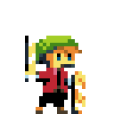
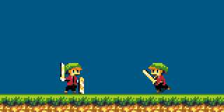
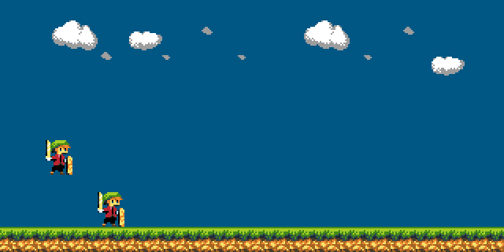

Verlossen
=========

Play with your friend across the world using state-of-the-art internet technology, and defend the plainlands against the incoming hoard of hungry boars.

##Development log:##

###Day 6 (March 6. 2015)###
Alrighty. I cleaned up the code a bit, but it's still terrible. Atleast
I have server-client gameplay communication working now. So you can join
the game and the server adds you and simulates you and stuff.

I need to look into several issues:

* The server crashes upon reconnections
* Implementing a map structure to hold clients on the server
* Find out why there is such latency when cl_update_rate is high, even
  running on local machine.

###Day 5 (March 5. 2015)###
Today was also more code structure work, not too exciting to look at unfortunately. I split the application into seperate server and client
sides. So now I can run the server as one process, and connect to the
server in a different process.

It's not complete yet though. The server doesn't actually update the
game, nor does it send updates. The client is still missing alot of
functionality as well.

What I'd like is to have a ``StepWorld(inputs)`` function, which can
be the same for both the server and the client. That way, I can do
updates on the server as well as on the client, which will be useful
for stuff like interpolating between client-side prediction and server
updates.

I might be seperating the client and the server a bit too hard though.
Now that I think about it, I don't actually want a server, I just want
a dedicated client which is authorative when it comes to world state.
Hmm, I'll need to sleep on that.

This post hasn't been much useful, so I'll just mention some of
my (technical) inspirations for this project:

* The much cited Valve article on [Multiplayer in the Source engine](https://developer.valvesoftware.com/wiki/Source_Multiplayer_Networking)

* The not-so-much cited related articles on [Prediction](https://developer.valvesoftware.com/wiki/Prediction), [Interpolation](https://developer.valvesoftware.com/wiki/Interpolation) and [Latency compensation](https://developer.valvesoftware.com/wiki/Latency_Compensating_Methods_in_Client/Server_In-game_Protocol_Design_and_Optimization)

* fogleman's [Craft](https://github.com/fogleman/Craft), a Minecraft clone written beautifully in C. It uses TCP for network communication (I use UDP for max throughput!!), but it's still interesting structure-wise.

###Day 4 (March 4. 2015)###

The hard problems are starting now. After thinking for a bit, I realized
I need to seperate my game into two modes: Server and Client. The server
will accept inputs from all players, and advance the world simulation in
lockstep.

Now here comes the tricky bit. Because I sample input at a lower rate than
the game framerate, a client may have given multiple inputs since the last
frame. These need to buffered, and sent as a single packet when it is time
to send an update. The server then applies the inputs chronologically.

But things get ugly with multiple clients. Look at this approach:

    Server:
        forever:
            for client in clients
                for input in client.buffer
                    StepWorld(input)

The server spins through a client's buffered inputs, until there are no
more, and then it goes on to the next client, and spins through their
inputs. The problem with this is that to simulate the world, we need
all clients' inputs. The world can not be updated independently per
client. So we need to do something like:

    Server:
        forever:
            inputs_this_step = {}
            for client in clients:
                inputs_this_step[client] = client.buffer.read_one()
            StepWorld(inputs_this_step)

This gets even more ugly when you realize that each client have may have
different latencies. This means that the simulation input may consist of
user inputs that were applied at totally different times.

Anyway. To accommodate this, I needed to have a list type that can be
read from one end, and written to on the other. A first-in-first-out sort
of thing. So I implemented a ring buffer. It's like an array, but shaped
like a snake:

At any moment, you may read from a location that has been written (blue).
And you may write to a location that is available (gray). Already read
locations (red) are made available for writing again. So if you read
relatively as often as you write, you never run out of space!

* **Compile time**: 1.8 seconds
* **Player count**: 1 (oh no!)

###Day 3 (March 3. 2015)###
Spent some time making a running animation and a sort of idle animation. The game (if I can call it that) looks alot more spenstig now - as we say in Norway.

Regarding the network code: I'm thinking I'll need to make one of the players a "host" or "master" sort of thing. My argument is that if the game will have enemy entities that both players can interact with, then someone needs to simulate those enemies.

* One approach is to let both players have a list of active enemies, that they simulate locally and share with the other player. But this requires some messy synchronization, and I really don't want to do that.

* A - probably cleaner - approach, is to make one of the players a dedicated world master. The world master will simulate the world, given both player inputs, and send the result back.

I suppose the world master can be both a remote server, or something that runs locally on one of the player's machines. But I probably want to have the player that creates a new game be the master, and the joinee listens. To make things appear smooth, I suspect I'll need to simulate (predict?) the world state locally as well, and then blend in the actual world state when it arrives over the network.

* **Compile time**: 1.9 seconds (!)
* **Art assets**: 3
* **Source files**: 9

###Day 2 (March 2. 2015)###

*Aw yiss*. Got networking going. Somewhat. It's really janky and needs more work. To be specific, I'll need to describe how it works so far. I am currently sending both player position and input over the network. When I receive updates from someone else, I add their character if not added already.

On every consequent update, I update the second player's position whenever I get a new network packet, and simulate with the input until the next packet. This results in ugly jitter due to delays across the web, so I should rather use some interpolation scheme to smoothly blend between simulated state and measured state. More that later!

* **Compile time**: 1.6 seconds
* **Art assets**: 2
* **Source files**: 9
* **Player count**: 2

Also, note the slight art modification. Our hero is no longer a vampire! (What is he though, a bard?)

###Day 1 (March 1. 2015)###

Made character and scenery artwork. This might be the best art that my hands have ever produced. I use Arne's 16-color palette, which is amazing and delicious and you should use it too.

* **Compile time**: 1.4 seconds
* **Art assets**: 2
* **Source files**: 9

###Day ?? (??)###
Wrote the machinery that will hold this thing together. Compile times are fast, which is a good sign. Wrote some rudimentary socket code, but only for windows. I suspect that socket programming is pretty similiar on linux as well though, so porting will be a breeze.

* **Compile time**: 1.2 seconds
* **Source files**: 9
