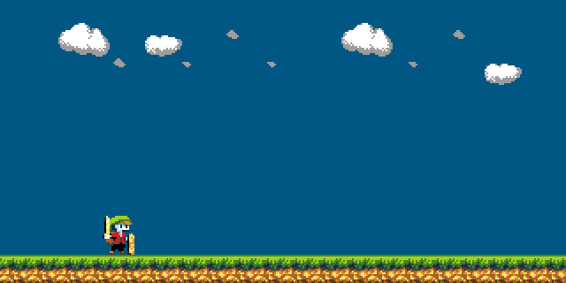

Verlossen
=========

Play with your friend across the world using state-of-the-art internet technology, and defend the plainlands against the incoming hoard of hungry boars.

##Development log:##

###Day 1 (March 1. 2015)###

Made character and scenery artwork. This might be the best art that my hands have ever produced. I use Arne's 16-color palette, which is amazing and delicious and you should use it too.

* **Compile time**: 1.4 seconds
* **Art assets**: 3
* **Source files**: 9

###Day ?? (??)###
Wrote the machinery that will hold this thing together. Compile times are fast, which is a good sign. Wrote some rudimentary socket code, but only for windows. I suspect that socket programming is pretty similiar on linux as well though, so porting will be a breeze.

* **Compile time**: 1.2 seconds
* **Source files**: 9
