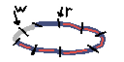

Verlossen
=========

Play with your friend across the world using state-of-the-art internet technology, and defend the plainlands against the incoming hoard of hungry boars.

##Development log:##

###Day 17 (April 15. 2015)###
Alright, sat down and worked out some kinks. My problem this whole time has
basically been how to perform that prediction step on the client, so that
there will be as little difference between what you have simulated locally
and the latest server update.

There were several things that threw me off while implementing this though.
One, is that the game loop basically consists of things being done at
different rates. The input is sampled and sent at one rate, but the game
is being advanced at another. This meant that if the game tickrate was
higher than the input sampling rate, then the same input would be applied
for more than one frame.

This was important to get right in the prediction routine.
I fixed it by labelling each input, clientside, with a counter that
increases each game tick. So if A and B are inputs, then B.label - A.label
gives me the number of frames that B was used for.

Second, is that VSync messed everything up. When VSync is enabled, a call
to ``SDL_RenderPresent`` will essentially put the calling thread to sleep,
until "vertical blank". Naturally, this is going to ruin all my timer loops,
since I'm not using multiple threads.

As of now I have VSync disabled, since I don't want to deal with threading.
But it's probably something I'll want to have a look at.

Anyway, it's fun when stuff works after fiddling with it for too long.
All I have to show right now is just boring squares though.

###Day 16 (April 13. 2015)###
Hmmm. There is something slightly off about the prediction scheme I'm running.
I think it may have to do with some timing issues. I also realized that having
vsync enabled caps your game loop to running at a maximum rate, which is not
good if you want to send network updates at a rate higher than 60fps! So I'm
trying to wrap my head around all this, but I have no progress to show today.

Instead I'll refer to a fantastic, practical talk about networking for games by Glenn Fiedler. His main focus is for physics, but I managed to take alot of good information from it. Check it out [here](http://gdcvault.com/play/1022195/Physics-for-Game-Programmers-Networking).

###Day 15 (April 9. 2015)###
Alright, I did some due diligence and found out that guesstimating round-trip-time was the wrong way to go. This article [here](http://www.gabrielgambetta.com/fpm_live.html) shows an approach where the server tells the client which input it processed last. Given that information, we can predict the server state more accurately by playing back inputs from the last one we know was processed! Here's how it looks:

Notice how there's no error at the end, as opposed to my previous attempt.

So yesterday I mentioned that there was another problem, namely the jitter that is apparent from the motion of the blue square. I made an attempt to fix that today, by a simple linear combination that I apply each frame. It looks like this:

The way it works is something like

    loop:
      when: receive update from server
        B = update.state

      when: time to update game
        UpdateGame(A)
        InterpolateState(A, B, lerp)

      RenderGame(A)

where **InterpolateState** performs the blending **(A = A + (B - A) * lerp)** for each player position component. So if state B is constant, the rendered state A will eventually converge to B. You can see this by expanding the expression, and seeing that it forms a geometric series.

Interpolation is particularly useful if you have packet drop (say 40% of it, as in the gif), since it hides most of the extreme jitter that would otherwise make the game unplayable:

If you look closely, you can see the orange square speeding up and slowing down. This is something I would like to fix. Perhaps by using a different interpolation function?

###Day 14 (April 8. 2015)###
Sweet! I think I've got something that sorta kinda works now! The gif below shows my progress. The white square is the server state, the orange is our locally simulated state and the blue square is the predicted state.

The problem I was trying to solve was sort of vague and floaty until I actually sat down with pen and paper today. The previous devlog entries didn't really explain what the issue was, or how to solve it. But I think I can do a better attempt now.

    | = Network event.
    + = Game tick

          B C
    |-+-+-+-|-+-+-+-|-+-+-+-|-+-+-+-|-+-+-+-| Server ticks
         /   \
        /      \
       /         \
    +-|-+-+-+-|-+-+-+-|-+-+-+-|-+-+-+-|-+-+-+ Client ticks
      A           D

Consider the above diagram. The client and server both run at the same tickrate, but may not be synchronized. Here's a run-down:

* At time A, the client sends its input to the server. This takes time, and the server first gets the input at time B.

* At time C it is time to send a snapshot to all clients, and the server does so.

* Our client gets the snapshot at time D.

The issue here is two-fold.

 1. The server gets our input delayed by B - A time.
 2. The client gets the snapshot delayed by D - C.

I don't really know what to do about the first issue, so I'll only consider the second issue. Now why is the snapshot delay a problem? Let me show you:

As before, orange square is local simulation, white is server update.

In most cases, unless your game is running on localhost, you're going to have some network lag. This lag causes a noticeable delay between keypresses and getting a response from the server. For real-time applications like games, this is unacceptable.

That is where prediction can help us.

          B C
    |-+-+-+-|-+-+-+-|-+-+-+-|-+-+-+-|-+-+-+-| Server ticks
         /   \
        /      \
       /         \
    +-|-+-+-+-|-+-+-+-|-+-+-+-|-+-+-+-|-+-+-+ Client ticks
      A           D

Referring to the diagram again: what we want to do, whenever we get a server update, is to predict what we think the state actually is at the server at that point in time. I.e. if we receive a snapshot at time D sent at time C from the server, we want to predict what a snapshot sent at time D would look like, using the latest snapshot.

The way I do this, is that I guesstimate the round-trip-time D-A, and approximate the prediction time D-C by half this amount. This isn't going to be accurate, but it will hopefully be in the ballpark of the actual value.

I then use the input history from time A and onwards, and simulate the latest snapshot forward for however many ticks I estimate I need. A mistake I did here first time around, was to use the "N latest" input values of the history. But that clearly isn't right, since it was the "N first" since A that will actually be used on the server to produce the snapshot at time D.

The way I think about the input history is like a sliding window, that keeps N latest inputs. Now I store more inputs than what constitutes the prediction interval, so I need to fast-forward until there remain what corresponds to D-A ticks worth of inputs. You can see this in my code.

To justify the use of round-trip-time, I'll mention the numbers used in the first gif. It was running with 100 ms inbound and outbound network lag. Which corresponds to a 400 ms round-trip-time. I set the estimated round-trip-time to 12 ticks, or 600 ms with a tickrate of 20 ticks/sec. So it's in the ballpark-range atleast.

###Making it better###
You can tell that using the blue square somewhat solves the delay problem, but we have another problem. And that is jitter. The orange square is clearly more smooth, so we would like to somehow have the best from both squares - accuracy (blue) and smoothness (orange).

I haven't tackled this yet, it will be the problem for the next coming days, but my plan is to perform some blending between the two.

###Day 13 (April 7. 2015)###
Started implementing prediction and interpolation today. If we run the game locally on each client, then the clients will eventually be ahead of the server in gametime. This is due to the time it takes for bytes to go from the server's memory, down the network layers, through the tubes, and up your layers into your memory.

Here's a gif showing how we get jitter if we simply set the local state equal to the incoming server update

Totally not cool!

What I tried to do today was something like

    GotServerUpdate:
        Guesstimate packet delay
        Project received server state ahead by that amount

But it doesn't look too good yet. To test delays and stuff I use this
cute application: [Clumsy](http://jagt.github.io/clumsy/). It runs
without installation, and lets you "inject" stuff like lag, throttling
or out-of-order packets dynamically. Pretty neat!

###Day 12 (April 6. 2015)###
Got back from a trip to Japan. Was bam-smack in the middle of hanami-
season, when all the salarymen go wild under the beautiful cherry
blossoms. Anyhoo, looking at code I haven't touched in two weeks is
rather devestating when it comes to motivation. But I grit my teeth
together and did some small work today - visualizing data from server.

Hopefully I'll implement some state interpolation this week, and bring
back the actual game code soon!

###Day 11 (March 15. 2015)###
Got a bunch of low-level work done today.
* I added a high-level interface for the network module. So now the
  server or client can simply send state or inputs, and the network
  module takes care of encoding/compression and decoding/decompression.

* I added a way to index different players currently connected, so
  that I can know which inputs go to which player.

I improved the way I manage clients, but it's somewhat bad I think.
I ran into far too many bugs where I iterated over the wrong counter,
so I should probably do something about that. Maybe I'll keep an index
table inside the list, that is automatically updated...

###Day 10 (March 13. 2015)###
Alrighty, got sequence numbers and acknowledgments working. Sequence
numbers are labels added to the snapshots sent from the server or the
inputs sent from the client. Since UDP is super unreliable and stuff,
it might happen that packets come in the wrong order! But with sequence
 numbers, you can figure out if the packet you got is infact newer than
 the one you have already.

Acknowledges are also nice to have, since you can do something called
**delta compression** to reduce bandwidth required by your game. You
basically store a sliding window of snapshots on the server, and tag
each client with which snapshot they last received. When it's time to
send a new snapshot, you can compare it with the last one you know they
got, and only send the differences!

Huge savings are possible!

###Day 9 (March 12. 2015)###
Progress! Current feature set of the networking module is now

* Clients can connect and disconnect
* Clients will detect timeouts from server and attempt to reconnect
* The server will detect timeouts from clients and remove them
* Clients can specify a desired ``cmdrate`` and ``rate``

The last point might need elaboration. I'm following Valve's naming
convention here, since I'm used to it from fiddling with the console
in Team Fortress 2. So ``cmdrate`` denotes how many times per second
the client should send an update (command) to the server. ``rate`` is
our desired server-updates per second, and is a hint sent to the server.

I'm still running this module on a very simplified version of the game,
since I want to get the basic feature set down first. The next thing I
want to implement is some form of local prediction and interpolation.
So right now the client looks somewhat like this:

    client loop:
        if time since last cmd sent > 1/cmdrate:
            send cmd

        if update recv:
            state = update.state

        render game

If I only update the state when we get it from the server, the game will
look way choppy and feel really bad in terms of lag. For this reason,
fast-paced games usually advance the game on the client as well, but
blend the predicted state together whenever an update comes in.

To illustrate in beautiful pixellated graphics, say we have received
the state for timesteps 0 to 1, but we have a higher framerate than
our update rate, and we are currently rendering the state at timestep 5.

To get there, we had to predict what the game would look like for
frames 2 throughout 5, given the last server update and our input
at those frames. Say we now get a new update from the server:

Because the server represents the **true** game state, shared with
all clients, we need to synchronize with it. But if we reset our
state to the incoming update, we would clearly be rendering an old
state!

Instead, what we can do is reset our state to the incoming server
state, and predict frames 3 through 5 again, but now with a different
"initial state".

To compute the game state for frame 3 through 5, we need the input
we applied during frame 2 through 4. And this is where the ringbuffer
comes in. Instead of storing all inputs since the dawn of UNIX, we
store a handful - corresponding to how much lag we estimate we have -
in a ringbuffer, and pop one off when we get a server update.

###Day 8 (March 11. 2015)###
Got some simple network statistics logging going on. I now keep track of
the average number of bytes sent and received. The averages are recomputed
every once in a while, so that I can actually read the numbers. I like to keep debug interfaces as minimal as possible so that they don't obfuscate the true
functionality of your code. This is how it looks:

    int main() {
        ...
        NetStats stats = NetGetStats();
        printf("%.2f KBps out\n", stats.avg_bytes_sent / 1024);
        printf("%.2f KBps in\n", stats.avg_bytes_read / 1024);
        ...
    }

All initialization and keeping track of last time the average was computed
is kept inside the networking module. I'd like to be able to measure round-trip-time for packets as well, but that would probably require some acknowledgment scheme, which I currently don't have.

[Quake 3](http://fabiensanglard.net/quake3/network.php) does this to some extent. It's not full-on reliability like TCP, since that would be silly, but more like the server goes "Hey, I just sent you snapshot number 591823, it would be cool if you could acknowledge that."

But the snapshot might get lost or corrupted towards the client, and the
acknowledgment might get lost or corrupted on its way back to the server. If the server does get an ack, it knows that the player has got snapshots atleast since that number. Using that it can do a diff before sending new snapshots to reduce the amount of data being sent.

Pretty neat!

###Day 7 (March 10. 2015)###
I think I caught a cold before the weekend, so the last 4 days have been somewhat of a productivity slump. But I rewrote the server-client code.
And this time I'm kind of happy with how it's layed out. I generally think
it's a bad idea to fuss about this sort of stuff early on, since most up-front
designs tend to get the small details wrong. And if you want a beautiful
program, you need to get those right.

Here's some pixels.

* Source files: Too many
* Player count: 0 (dang)
* Compile time: 2.9s

###Day 6 (March 6. 2015)###
Alrighty. I cleaned up the code a bit, but it's still terrible. Atleast
I have server-client gameplay communication working now. So you can join
the game and the server adds you and simulates you and stuff.

I need to look into several issues:

* The server crashes upon reconnections
* Implementing a map structure to hold clients on the server
* Find out why there is such latency when cl_update_rate is high, even
  running on local machine.

###Day 5 (March 5. 2015)###
Today was also more code structure work, not too exciting to look at unfortunately. I split the application into seperate server and client
sides. So now I can run the server as one process, and connect to the
server in a different process.

It's not complete yet though. The server doesn't actually update the
game, nor does it send updates. The client is still missing alot of
functionality as well.

What I'd like is to have a ``StepWorld(inputs)`` function, which can
be the same for both the server and the client. That way, I can do
updates on the server as well as on the client, which will be useful
for stuff like interpolating between client-side prediction and server
updates.

I might be seperating the client and the server a bit too hard though.
Now that I think about it, I don't actually want a server, I just want
a dedicated client which is authorative when it comes to world state.
Hmm, I'll need to sleep on that.

This post hasn't been much useful, so I'll just mention some of
my (technical) inspirations for this project:

* The much cited Valve article on [Multiplayer in the Source engine](https://developer.valvesoftware.com/wiki/Source_Multiplayer_Networking)

* The not-so-much cited related articles on [Prediction](https://developer.valvesoftware.com/wiki/Prediction), [Interpolation](https://developer.valvesoftware.com/wiki/Interpolation) and [Latency compensation](https://developer.valvesoftware.com/wiki/Latency_Compensating_Methods_in_Client/Server_In-game_Protocol_Design_and_Optimization)

* fogleman's [Craft](https://github.com/fogleman/Craft), a Minecraft clone written beautifully in C. It uses TCP for network communication (I use UDP for max throughput!!), but it's still interesting structure-wise.

###Day 4 (March 4. 2015)###

The hard problems are starting now. After thinking for a bit, I realized
I need to seperate my game into two modes: Server and Client. The server
will accept inputs from all players, and advance the world simulation in
lockstep.

Now here comes the tricky bit. Because I sample input at a lower rate than
the game framerate, a client may have given multiple inputs since the last
frame. These need to buffered, and sent as a single packet when it is time
to send an update. The server then applies the inputs chronologically.

But things get ugly with multiple clients. Look at this approach:

    Server:
        forever:
            for client in clients
                for input in client.buffer
                    StepWorld(input)

The server spins through a client's buffered inputs, until there are no
more, and then it goes on to the next client, and spins through their
inputs. The problem with this is that to simulate the world, we need
all clients' inputs. The world can not be updated independently per
client. So we need to do something like:

    Server:
        forever:
            inputs_this_step = {}
            for client in clients:
                inputs_this_step[client] = client.buffer.read_one()
            StepWorld(inputs_this_step)

This gets even more ugly when you realize that each client have may have
different latencies. This means that the simulation input may consist of
user inputs that were applied at totally different times.

Anyway. To accommodate this, I needed to have a list type that can be
read from one end, and written to on the other. A first-in-first-out sort
of thing. So I implemented a ring buffer. It's like an array, but shaped
like a snake:

At any moment, you may read from a location that has been written (blue).
And you may write to a location that is available (gray). Already read
locations (red) are made available for writing again. So if you read
relatively as often as you write, you never run out of space!

* **Compile time**: 1.8 seconds
* **Player count**: 1 (oh no!)

###Day 3 (March 3. 2015)###
Spent some time making a running animation and a sort of idle animation. The game (if I can call it that) looks alot more spenstig now - as we say in Norway.

Regarding the network code: I'm thinking I'll need to make one of the players a "host" or "master" sort of thing. My argument is that if the game will have enemy entities that both players can interact with, then someone needs to simulate those enemies.

* One approach is to let both players have a list of active enemies, that they simulate locally and share with the other player. But this requires some messy synchronization, and I really don't want to do that.

* A - probably cleaner - approach, is to make one of the players a dedicated world master. The world master will simulate the world, given both player inputs, and send the result back.

I suppose the world master can be both a remote server, or something that runs locally on one of the player's machines. But I probably want to have the player that creates a new game be the master, and the joinee listens. To make things appear smooth, I suspect I'll need to simulate (predict?) the world state locally as well, and then blend in the actual world state when it arrives over the network.

* **Compile time**: 1.9 seconds (!)
* **Art assets**: 3
* **Source files**: 9

###Day 2 (March 2. 2015)###

*Aw yiss*. Got networking going. Somewhat. It's really janky and needs more work. To be specific, I'll need to describe how it works so far. I am currently sending both player position and input over the network. When I receive updates from someone else, I add their character if not added already.

On every consequent update, I update the second player's position whenever I get a new network packet, and simulate with the input until the next packet. This results in ugly jitter due to delays across the web, so I should rather use some interpolation scheme to smoothly blend between simulated state and measured state. More that later!

* **Compile time**: 1.6 seconds
* **Art assets**: 2
* **Source files**: 9
* **Player count**: 2

Also, note the slight art modification. Our hero is no longer a vampire! (What is he though, a bard?)

###Day 1 (March 1. 2015)###

Made character and scenery artwork. This might be the best art that my hands have ever produced. I use Arne's 16-color palette, which is amazing and delicious and you should use it too.

* **Compile time**: 1.4 seconds
* **Art assets**: 2
* **Source files**: 9

###Day ?? (??)###
Wrote the machinery that will hold this thing together. Compile times are fast, which is a good sign. Wrote some rudimentary socket code, but only for windows. I suspect that socket programming is pretty similiar on linux as well though, so porting will be a breeze.

* **Compile time**: 1.2 seconds
* **Source files**: 9
